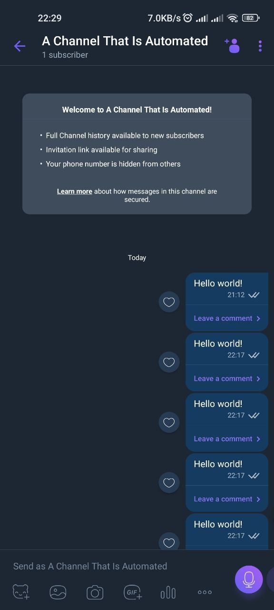

# Viber Channel Auto Poster

This guide will illustrate how to setup a Viber channel auto poster using a simple flask server as the webhook. Viber requires the webhook to respond with a 200 response. They also require the webhook URL to have a trusted certificate. Self signed certificates will not work.

## Creating a channel

Open Viber and create a channel. Go the right-side menu and click developer tools to get the `Authentication Token`

## The Flask Server, Webhooks & Certbot

Viber requires us that the flask server returns 200 when setting the webhook

As there is no two way communication ( as this is not a bot ) so the webhook only needs to be setup once. I have tested this with sending messages to the channel after shutting down the flask server and it works.

Unless Viber does a check once in a while, the server not continuously running should not be a problem. (correct me with a pull request)

Before setting up the flask script, make a subdomain for a domain you own through cloudflare DNS. It should be an A record that points to the ip of your webhook server.

After this is done install certbot and follow the guide on certbots website. Do not say that you are using nginx or anything else. (As you are not using anything)

Once this part is done you can write the flask server python script. Make sure to record the locations of the .pem files certbot gave.

### The flask python script

only needs flask and does not need a viber library for python (as we are not using the bot api)

Install flask with pip install -r requirements.txt

```python
from flask import Flask, Request, Response, request
import logging

#Logging
logger = logging.getLogger(__name__)

#Initialization
app = Flask(__name__)

@app.route('/', methods=['POST'])
def incoming():
    # log what we just recieved
    logger.debug("received request. post data: {0}".format(request.get_data()))

    # X-Viber-Content-Signature needs to be in the header of the request
    if request.headers.get('X-Viber-Content-Signature') is None:
        return Response(status=403) # respond with 403 if not

    # respond with 200
    return Response(status=200)

if __name__ == "__main__":
    app.run(host='0.0.0.0', port=443, debug=True, ssl_context=('fullchain.pem', 'privkey.pem'))

# above file locations are NOT the default locations set by certibot.
# edit them to have the locations you recorded before
```

### Sending the requests

Using your favourite request sending tool ( Firefox Dev Edition is cool but I used Insomnia ), send a POST request with JSON post data. Replace auth_token with the token you got from the first section of this README article.

1. `https://chatapi.viber.com/pa/set_webhook`

```python
{
   "url":"https://my.host.com",
   "auth_token":"your_auth_token"
}
```

Remember to run the flask server before this is sent and if everything is well, you should be getting a 200. Anything else is a failure including status code 1.

## We need a unique user id too

Before we get into sending messages and using the other api endpoints we also need a userid which can be got by sending a post request to get_account_info

1. To get that we would be sending a post request to : `https://chatapi.viber.com/pa/get_account_info`

   1. with the following as post data

   ```python
   {
      "auth_token": "your_auth_token"
   }
   ```

   user id will be returned from this

   ```python
   {
   	"status":0,
   	"status_message": "ok",
   	"Id": "pa:75346594275468546724",
   	"chat_hostname": "Channel name",
   	"background":
   	"https://content.cdn.viber.com/backgrounds_v1/Android/800/10000501.jpg",
   	"members":[
   		{
   		"id":"01234567890A=",
   		"name": "my name",
   		"avatar" :"https://example.com",
   		"role":"admin"
   		}
   	]
   }
   ```

   01234567890A= is the user id in the above case

## Sending the message

Like we did before we would be sending a post request to the following address with the message contents

`https://chatapi.viber.com/pa/post`

```json
{
  "auth_token": "your_auth_token",
  "from": "your_user_id",
  "type": "text",
  "text": "Hello world!"
}
```



As the point of this readme was to discuss the setup rather than every API endpoint please follow up on [https://developers.viber.com/docs/tools/channels-post-api/](https://developers.viber.com/docs/tools/channels-post-api/)

## Developing further

Taking this simple setup we can do automated channels from scripts by sending requests just like we do any telegram automated channel script.
